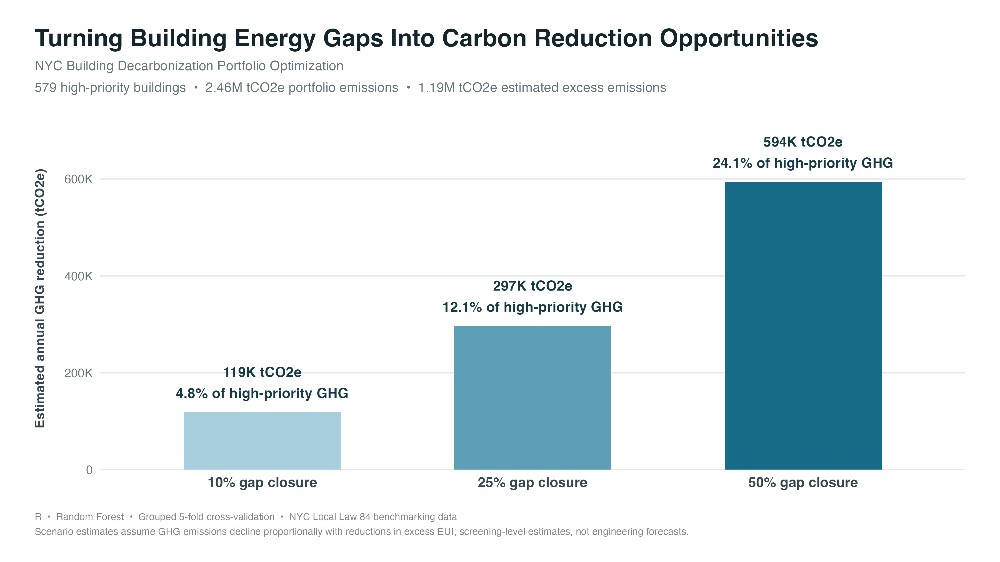
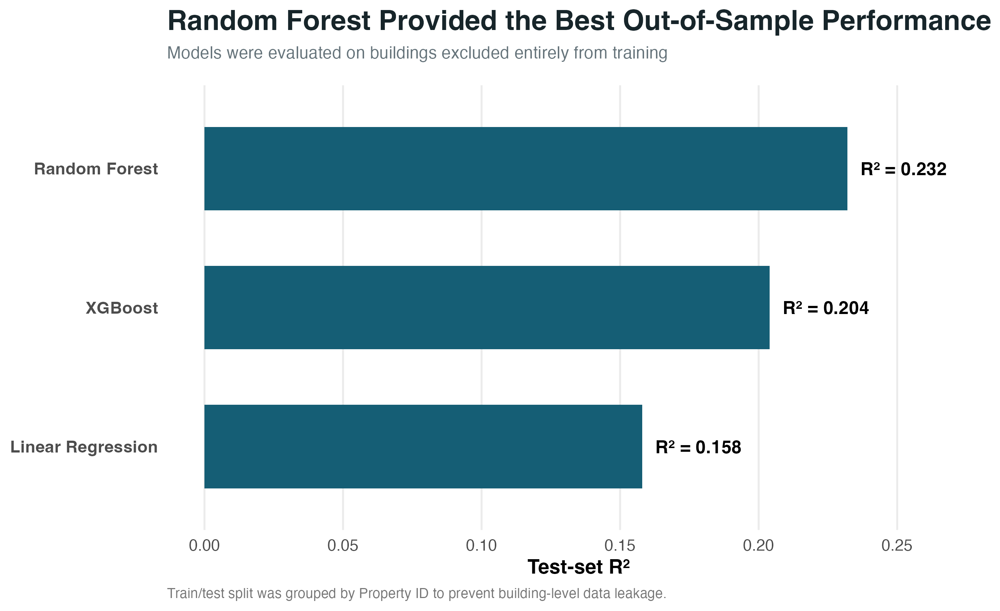
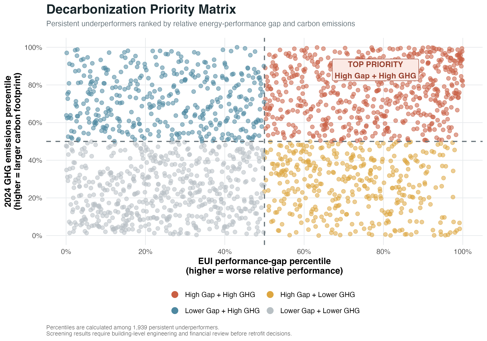

# NYC Building Decarbonization Portfolio Optimization

A data-driven portfolio screening project that uses New York City Local Law 84 building benchmarking data, machine learning, and greenhouse gas emissions analysis to identify high-priority building decarbonization opportunities.

## Project Overview

This project analyzes NYC building energy benchmarking data from **2022–2024** to answer a practical decarbonization question:

> **Which buildings consistently use more energy than expected for their characteristics, and which of those buildings also represent meaningful carbon-reduction opportunities?**

The workflow combines:

- Multi-year building energy benchmarking
- Property-type and peer comparison
- Machine-learning EUI prediction
- Persistent underperformance screening
- GHG emissions prioritization
- Carbon-reduction scenario analysis

## Key Results

- **21,649 buildings** included in the balanced 2022–2024 panel
- **1,939 persistent underperformers** with valid 2024 GHG data
- **579 high-priority buildings** identified as both high-gap and high-GHG
- **2.46 million tCO2e** of 2024 emissions associated with the high-priority group
- **1.19 million tCO2e** estimated excess GHG emissions
- **594,235 tCO2e/year** estimated reduction under a 50% EUI gap-closure scenario
- Random Forest achieved the strongest test-set performance with **R² = 0.232**

## Carbon Reduction Opportunity



The scenario analysis suggests that partially closing the modeled energy-performance gap among high-priority buildings could correspond to substantial carbon reductions. These estimates are intended for **portfolio screening**, not as building-level engineering forecasts.


## Methodology

The project uses a multi-stage screening workflow to move from raw benchmarking records to a focused set of decarbonization candidates.

### 1. Build a consistent multi-year panel

NYC Local Law 84 benchmarking data from 2022–2024 were cleaned and harmonized across years.

The analysis:

- Removed or resolved duplicate annual submissions
- Excluded implausible or incomplete records used for modeling
- Standardized key fields across years
- Created a balanced panel of buildings observed in all three years

The balanced panel contains **21,649 buildings**.

### 2. Benchmark building energy performance

Site EUI was modeled using building characteristics including:

- Property type
- Floor area
- Borough
- Calendar year
- Other available benchmarking attributes

Three regression approaches were compared:

- Linear Regression
- XGBoost
- Random Forest

To reduce building-level data leakage, buildings were assigned entirely to either the training or test set using **Property ID**.

## Machine-Learning Model Comparison



Random Forest achieved the strongest out-of-sample performance:

| Model | Test-set R² |
|---|---:|
| Random Forest | **0.232** |
| XGBoost | 0.204 |
| Linear Regression | 0.158 |

For the Random Forest model:

- **RMSE:** 50.2 kBtu/ft²
- **MAE:** 27.7 kBtu/ft²
- **Grouped 5-fold CV mean R²:** 0.206

The model is therefore used as a **portfolio-screening benchmark**, rather than as a building-level engineering forecast.

### 3. Calculate building performance gaps

For each building, the model estimates an expected Site EUI.

The key benchmarking metric is:

> **Performance Gap = Actual EUI − Expected EUI**

A positive value indicates that a building is using more energy than expected relative to buildings with similar observed characteristics.

### 4. Identify persistent underperformers

Buildings were screened for persistent multi-year underperformance.

This produced:

- **1,940 persistent underperformers**
- **1,939 with valid 2024 GHG emissions data**

### 5. Combine energy underperformance with carbon impact

Persistent underperformance alone does not necessarily indicate the highest decarbonization value.

The final prioritization framework therefore combines:

> **Relative energy underperformance × absolute GHG emissions**

## Decarbonization Priority Matrix



The matrix separates buildings into four screening groups:

- **High Gap + High GHG**
- High Gap + Lower GHG
- Lower Gap + High GHG
- Lower Gap + Lower GHG

The **High Gap + High GHG** quadrant is treated as the primary screening group.

This identified **579 high-priority buildings**, representing approximately **2.46 million tCO2e of 2024 emissions**.


## Scenario Analysis

For the **579 high-priority buildings**, a screening-level scenario analysis estimates the potential GHG reduction associated with partially closing the modeled excess EUI gap.

| EUI Gap Closure | Estimated Annual GHG Reduction | Share of High-Priority GHG |
|---|---:|---:|
| 10% | **118,847 tCO2e** | 4.8% |
| 25% | **297,117 tCO2e** | 12.1% |
| 50% | **594,235 tCO2e** | 24.1% |

Under the 50% gap-closure scenario, the estimated reduction is approximately **594,000 tCO2e per year**.

These values are intended as portfolio-level screening estimates. The scenario assumes that GHG emissions decline proportionally as excess EUI is reduced.

---

## Project Outputs

The project produces both analytical outputs and presentation-ready deliverables.

### Main Figures

- `01_ghg_trend.png` — NYC building GHG trend, 2022–2024
- `02_eui_benchmark_2024.png` — 2024 EUI comparison by building type
- `03_eui_change_by_type.png` — Change in median EUI by building type
- `04_model_comparison.png` — Machine-learning model comparison
- `05_decarbonization_priority_matrix.png` — Building decarbonization priority matrix
- `06_ghg_reduction_linkedin.png` — GHG reduction scenario analysis

### Final Data Outputs

- `final_project_kpis.csv`
- `final_top20_priority_buildings.csv`
- `top_15_priority_buildings.csv`
- `priority_group_summary.csv`
- `high_priority_summary.csv`
- `ghg_reduction_scenarios.csv`

---

## Project Structure

```text
NYC_Decarbonization_Optimization/
├── data/
│   └── processed/
├── figures/
│   ├── exploratory/
│   ├── modeling/
│   └── final/
├── output/
│   ├── final_project_kpis.csv
│   ├── final_top20_priority_buildings.csv
│   ├── top_15_priority_buildings.csv
│   └── ghg_reduction_scenarios.csv
├── R/
│   ├── 00_setup.R
│   ├── 01_ingest_clean.R
│   ├── 02_panel_eda.R
│   ├── 03_feature_engineering.R
│   ├── 04_ml_benchmark.R
│   ├── 05_underperformance.R
│   └── 06_final_summary.R
├── report/
│   ├── NYC_Decarbonization_Executive_Summary.Rmd
│   ├── NYC_Decarbonization_Executive_Summary.html
│   └── NYC_Decarbonization_Executive_Summary.pdf
└── README.md
```

## Executive Summary

A polished executive summary of the project is available here:

📄 **[View the Executive Summary PDF](report/NYC_Decarbonization_Executive_Summary.pdf)**

The report summarizes the methodology, machine-learning benchmark, priority matrix, scenario analysis, key findings, and limitations.


## Tools and Technologies

**R · tidyverse · dplyr · ggplot2 · tidymodels · Random Forest · ranger · XGBoost**

**Focus areas:** Building energy benchmarking · Machine learning · GHG emissions analysis · Portfolio decarbonization · Sustainability analytics


