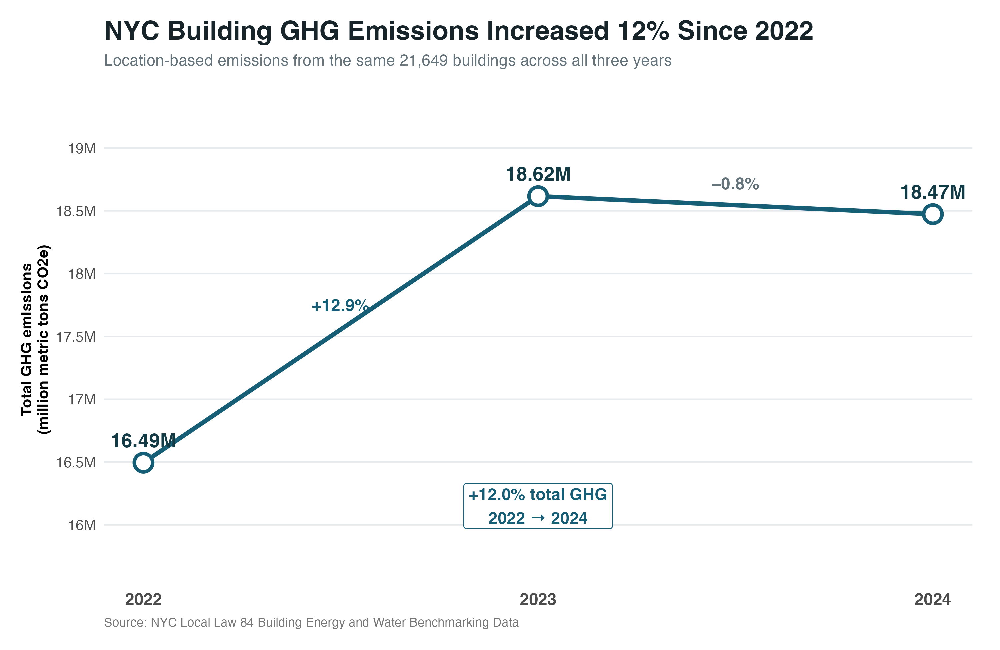

<style>

body {
  max-width: 1050px;
  margin: auto;
  padding: 35px 50px;
  font-family: -apple-system, BlinkMacSystemFont, "Segoe UI", Arial, sans-serif;
  color: #263238;
}

h1 {
  color: #173F4F;
  font-size: 32px;
  font-weight: 700;
  border-bottom: 3px solid #176B87;
  padding-bottom: 10px;
}

h2 {
  color: #176B87;
  font-size: 23px;
  margin-top: 32px;
}

h3 {
  color: #37474F;
}

.kpi-container {
  display: flex;
  gap: 15px;
  margin: 25px 0 30px 0;
}

.kpi {
  flex: 1;
  background: #F3F7F9;
  border-top: 4px solid #176B87;
  padding: 18px;
  text-align: center;
  border-radius: 4px;
}

.kpi-number {
  font-size: 26px;
  font-weight: 700;
  color: #176B87;
}

.kpi-label {
  font-size: 13px;
  color: #607D8B;
  margin-top: 5px;
}

.callout {
  background: #EEF6F8;
  border-left: 5px solid #176B87;
  padding: 16px 20px;
  margin: 22px 0;
}

.caption {
  font-size: 12px;
  color: #777777;
  margin-top: 5px;
}

img {
  width: 100%;
}


/* ==========================================================
   PRINT / PDF SETTINGS
   ========================================================== */

@page {
  size: Letter;
  margin: 0.55in 0.55in 0.60in 0.55in;
}

@media print {

  body {
    max-width: none;
    width: 100%;
    margin: 0;
    padding: 0;
    font-size: 10.5pt;
    line-height: 1.35;
    color: #263238;
  }

  h1 {
    font-size: 25pt;
    margin-top: 0;
    page-break-after: avoid;
    break-after: avoid-page;
  }

  h2 {
    font-size: 17pt;
    margin-top: 22px;
    page-break-after: avoid;
    break-after: avoid-page;
  }

  h3 {
    font-size: 13pt;
    page-break-after: avoid;
    break-after: avoid-page;
  }

  p {
    orphans: 3;
    widows: 3;
  }

  .kpi-container {
    display: flex !important;
    page-break-inside: avoid;
    break-inside: avoid-page;
  }

  .kpi {
    page-break-inside: avoid;
    break-inside: avoid-page;
  }

  .callout {
    page-break-inside: avoid;
    break-inside: avoid-page;
  }

  img {
    max-width: 100% !important;
    height: auto !important;
    page-break-inside: avoid;
    break-inside: avoid-page;
  }

  table {
    width: 100%;
    page-break-inside: avoid;
    break-inside: avoid-page;
  }

  blockquote {
    page-break-inside: avoid;
    break-inside: avoid-page;
  }

  hr {
    margin-top: 18px;
  }
}


</style>


# Executive Summary

This project developed a data-driven screening framework to identify high-priority building decarbonization opportunities across New York City.

Using NYC Local Law 84 building energy benchmarking data from 2022–2024, the analysis combined longitudinal energy-performance trends, machine-learning peer benchmarking, greenhouse gas emissions, and scenario analysis to identify buildings with persistent energy underperformance and high carbon impact.

<div class="kpi-container">

<div class="kpi">
<div class="kpi-number">1,939</div>
<div class="kpi-label">Persistent underperformers with 2024 GHG data</div>
</div>

<div class="kpi">
<div class="kpi-number">579</div>
<div class="kpi-label">High-gap, high-GHG priority buildings</div>
</div>

<div class="kpi">
<div class="kpi-number">2.46M</div>
<div class="kpi-label">tCO2e from high-priority buildings in 2024</div>
</div>

<div class="kpi">
<div class="kpi-number">594K</div>
<div class="kpi-label">tCO2e screening reduction at 50% gap closure</div>
</div>

</div>


## The Challenge

Building energy use varies substantially by property type, size, age, occupancy, location, and operating conditions. As a result, simply ranking buildings by raw energy use or emissions can favor the largest buildings without determining whether they are performing unusually poorly relative to comparable properties.

This project therefore asks:

> **Which NYC buildings consistently consume more energy than expected for their characteristics, and which of those buildings also represent meaningful carbon-reduction opportunities?**


## Data

The analysis uses official NYC Local Law 84 Building Energy and Water Benchmarking Data for calendar years 2022–2024.

The original dataset contained:

- **103,259 records**
- **48,310 unique properties**
- Building characteristics, floor area, occupancy, property type, energy use, EUI, electricity and natural gas use, and greenhouse gas emissions

Duplicate annual submissions were resolved using reporting timestamps, and implausible or incomplete records were excluded from the modeling dataset.

A balanced three-year panel contained **21,649 buildings** with valid observations in all three years.


## Energy and Carbon Trends

```{r fig1, echo=FALSE, out.width="100%"}

```
Across the balanced building panel, total location-based GHG emissions increased from approximately 16.49 million metric tons CO2e in 2022 to 18.47 million metric tons CO2e in 2024, an increase of approximately 12%.

However, energy-intensity trends differed substantially across property types, reinforcing the need for peer-adjusted benchmarking rather than relying only on citywide totals.

## Machine-Learning Peer Benchmark

Three regression approaches were evaluated for predicting Site EUI:

- **Linear Regression**
- **XGBoost**
- **Random Forest**

Buildings were assigned entirely to either the training or test set using Property ID, preventing observations from the same building from appearing in both sets.

```{r fig4, echo=FALSE, out.width="88%"}
knitr::include_graphics(
  "../figures/modeling/04_model_comparison.png"
)
```

Random Forest achieved the strongest test-set performance:

- **R² = 0.232**
- **RMSE = 50.2 kBtu/ft²**
- **MAE = 27.7 kBtu/ft²**

Grouped 5-fold cross-validation produced a mean **R² of 0.206**, indicating that the model is most appropriate as a portfolio-screening tool rather than a building-level engineering forecast.

The Random Forest predictions were therefore used to estimate an **Expected EUI** for each building.

The central benchmarking metric was:

> **Performance Gap = Actual EUI − Expected EUI**

Positive values indicate that a building uses more energy than predicted for buildings with similar observed characteristics.


## Persistent Underperformance

A building was flagged as a persistent underperformer when:

1. Actual EUI exceeded modeled Expected EUI in all three years.
2. Its three-year mean performance gap was among the higher-gap segment of the peer-screening population.

This produced **1,940 persistent underperformers**, of which **1,939 had valid 2024 GHG emissions data**.


## Decarbonization Priority Matrix

Persistent underperformance alone does not determine decarbonization priority. A building with an unusually high EUI gap may still have a relatively small carbon footprint.

The screening framework therefore combines:

> **Relative energy underperformance × absolute GHG emissions**

```{r fig5, echo=FALSE, out.width="100%"}
knitr::include_graphics(
  "../figures/modeling/05_decarbonization_priority_matrix.png"
)
```

The resulting matrix identified **579 buildings** in the **High Gap + High GHG** quadrant.

Together, these buildings reported approximately **2.46 million metric tons CO2e in 2024**.

Their median three-year EUI performance gap was approximately **92 kBtu/ft²**.

<div class="callout">

### Portfolio implication

Rather than treating all inefficient buildings equally, the framework concentrates attention on buildings that are both **persistently worse than modeled peers** and **large contributors to portfolio carbon emissions**.

</div>


## Carbon Reduction Scenario Analysis

A screening-level scenario analysis was used to estimate the carbon implications of partially closing the excess EUI gap among the **579 high-priority buildings**.

The calculation assumes GHG emissions decline proportionally as excess EUI is reduced.

```{r fig6, echo=FALSE, out.width="100%"}
knitr::include_graphics(
  "../figures/final/06_ghg_reduction_linkedin.png"
)
```

The scenarios indicate:

| EUI Gap Closure | Estimated Annual GHG Reduction | Share of High-Priority GHG |
|---|---:|---:|
| **10%** | **118,847 tCO2e** | **4.8%** |
| **25%** | **297,117 tCO2e** | **12.1%** |
| **50%** | **594,235 tCO2e** | **24.1%** |

These figures should be interpreted as **screening scenarios rather than engineering forecasts**. Actual retrofit potential depends on building systems, operating schedules, fuel mix, capital constraints, and project feasibility.


## Key Takeaways

The analysis demonstrates how public benchmarking data can be transformed into a portfolio-level decarbonization decision framework.

Rather than ranking buildings solely by emissions or energy intensity, the workflow:

1. Establishes comparable peer expectations using machine learning.
2. Identifies persistent multi-year underperformance.
3. Combines performance gaps with real carbon impact.
4. Prioritizes a manageable subset of buildings for deeper investigation.
5. Translates performance-improvement assumptions into transparent carbon-reduction scenarios.

The final screening identifies **579 high-priority buildings representing approximately 2.46 million tCO2e of 2024 emissions**.

Under the screening assumptions, a **50% closure of modeled excess EUI corresponds to an estimated 594,000 tCO2e per year reduction**.


## Limitations

This analysis is designed for **portfolio screening, not engineering diagnosis**.

The machine-learning model explains only part of observed building-level EUI variation, and the dataset does not fully capture:

- Operating schedules
- HVAC configurations
- Equipment condition
- Tenant behavior
- Retrofit history
- Other building-specific engineering characteristics

The scenario analysis also assumes proportionality between reductions in excess EUI and GHG emissions.

Accordingly, identified buildings should be interpreted as candidates for:

> **Energy audit → Engineering assessment → Financial analysis → Retrofit planning**

rather than as confirmed retrofit projects.

---

**Tools:** R · tidyverse · tidymodels · Random Forest · XGBoost · ggplot2  

**Data:** NYC Local Law 84 Building Energy and Water Benchmarking Data, 2022–2024